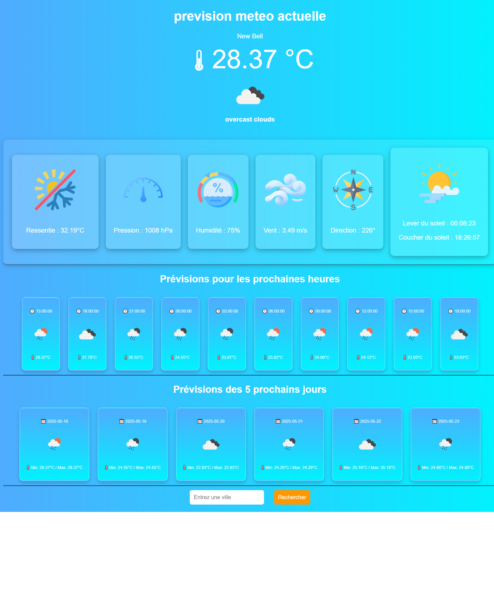

# 🌦️ Weather App - Application Météo en Temps Réel

Cette application web permet d'afficher les conditions météo actuelles ainsi que les prévisions horaires et journalières pour une ville donnée ou selon votre position actuelle via géolocalisation.

---

## 🔧 Fonctionnalités

- 📍 Détection automatique de la localisation de l'utilisateur
- 🏙️ Recherche météo par nom de ville
- 🌡️ Données météo détaillées :
  - Température actuelle et ressentie
  - Description du temps
  - Humidité, pression atmosphérique
  - Vitesse et direction du vent
  - Heure du lever et du coucher du soleil
- ⏰ Prévisions sur 12 heures (toutes les 3 heures)
- 📅 Prévisions sur 5 jours
- 🖼️ Icônes météo dynamiques
- 💅 Interface élégante avec effet de flou (glassmorphism)

---

## 📸 Capture d'écran



---

## 🛠️ Technologies utilisées

- HTML5
- CSS3 (avec `backdrop-filter`)
- JavaScript
- API [OpenWeatherMap](https://openweathermap.org/api)

---

## 🚀 Installation

1. Clone ce dépôt :

```bash
git clone https://github.com/ton-utilisateur/weather-app.git
